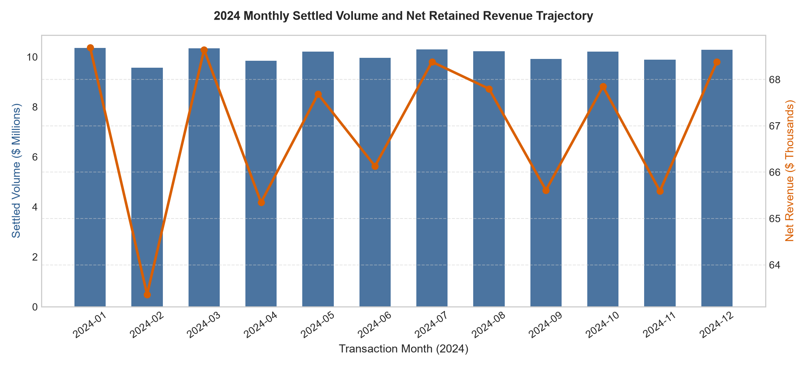
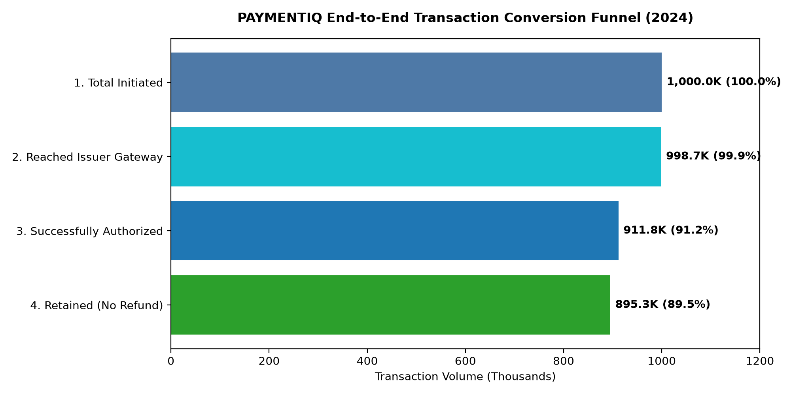
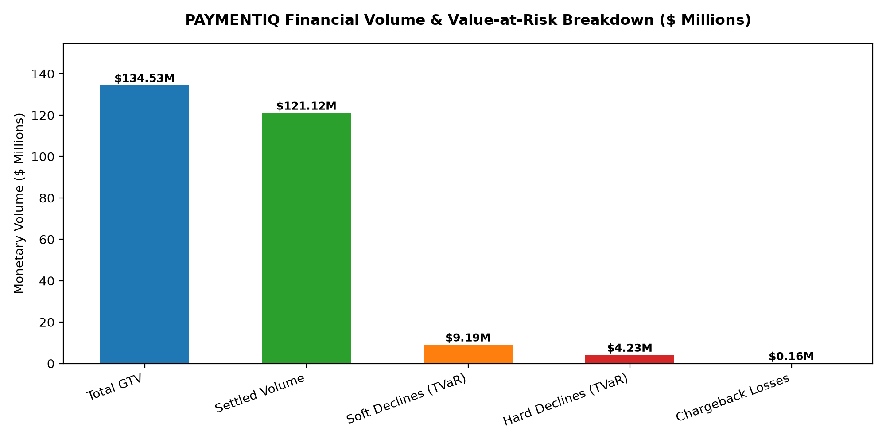
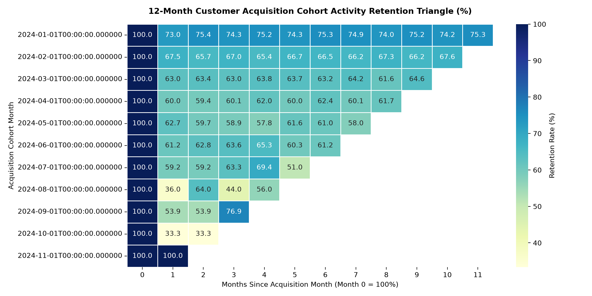
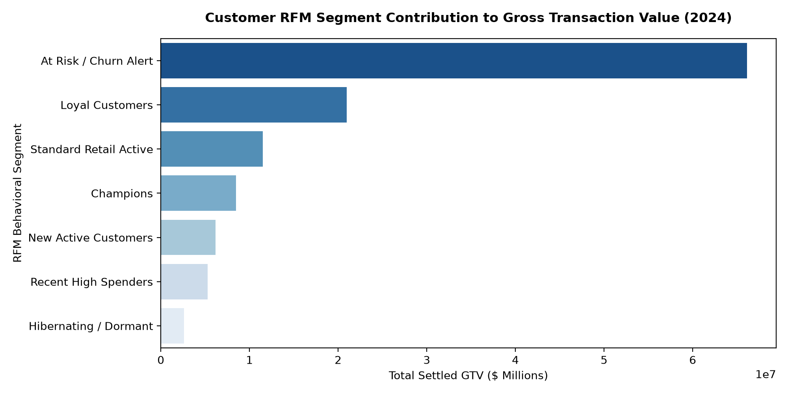
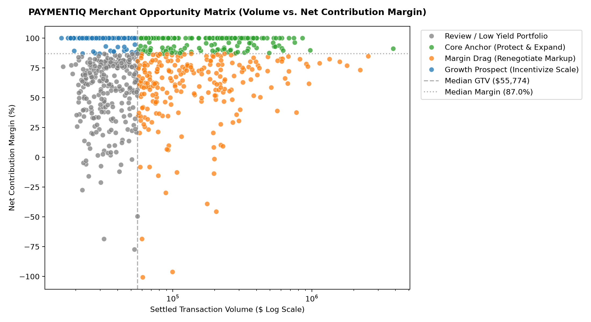
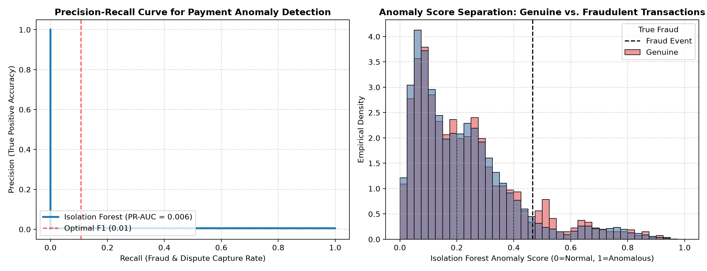
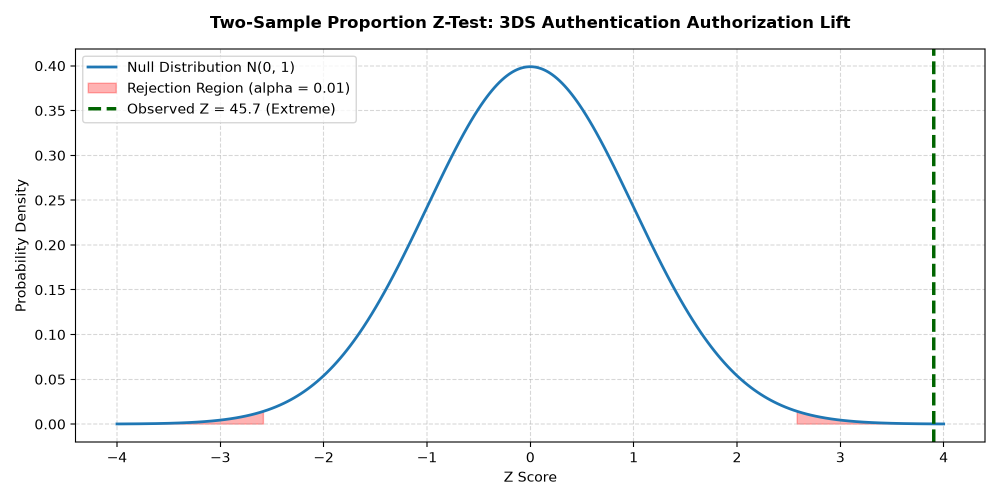
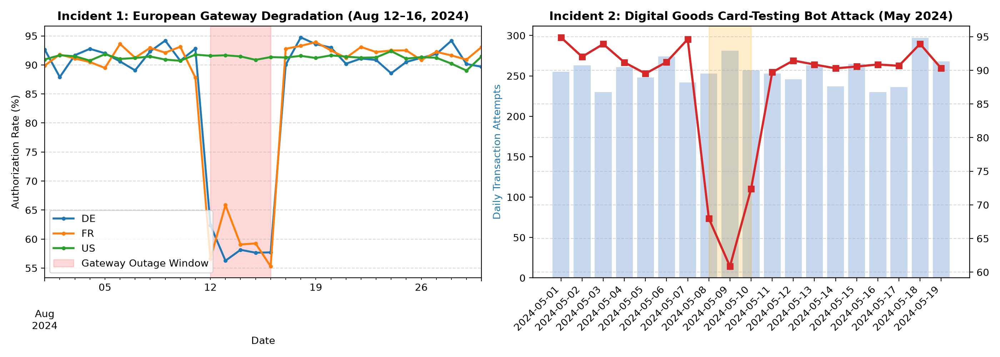
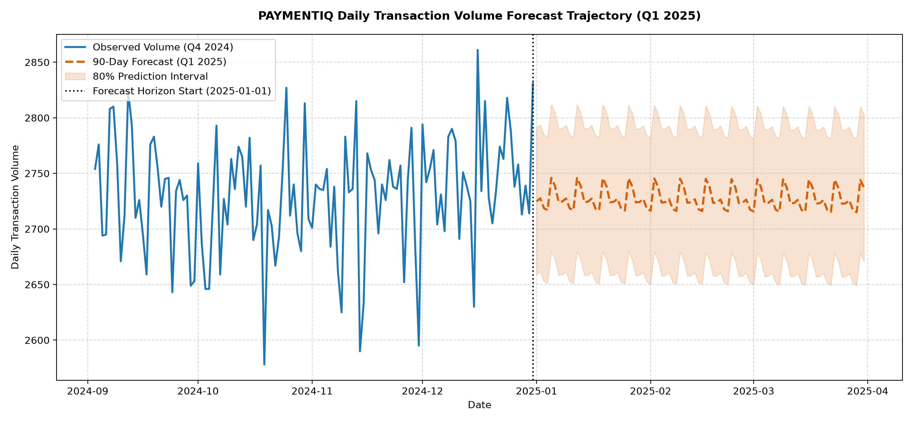

# PAYMENTIQ | Master Analytical Case Study & Business Intelligence Report

**Document Title:** End-to-End Payment Intelligence, Margin Optimization & Anomaly Surveillance  
**Author:** Hriday Singh Sobti  
**Role:** Lead Analytics Engineer & Financial Analytics Specialist  
**Deliverables Covered:** Interactive Power BI Dashboard (`.pbip`), Executive Review PDF, DuckDB & PostgreSQL Warehouse  
**Verified Dataset Scale:** 1,000,000 Transactions ($134.53M GTV) | 40,000 Cardholders | 1,000 Merchants  

---

## Deliverables & Access Links

- **📊 Interactive Power BI Dashboard:** [`powerbi/PAYMENTIQ.pbip`](../powerbi/PAYMENTIQ.pbip) (Full Tabular Model Definition in TMDL / `model.bim`)
- **📄 Executive Analytics Review PDF:** [`reports/PAYMENTIQ_Executive_Review.pdf`](../reports/PAYMENTIQ_Executive_Review.pdf) (6-Page Publication-Grade Briefing Document, 2.02 MB)
- **🔗 Primary Source Repository:** [`https://github.com/hriday-sobti/PAYMENTIQ`](https://github.com/hriday-sobti/PAYMENTIQ)

---

## Executive Summary

Global digital commerce relies on seamless checkout conversion, yet transaction failure is an inherent reality of payment networks. During the 2024 operating year, the PAYMENTIQ platform processed **1,000,000 payment transaction attempts**, representing **$134,531,743.69 in Gross Transaction Value (GTV)**. Of this demand, **$121,120,030.80 successfully converted to settled funds** across 911,844 approvals, delivering an overall platform **authorization rate of 91.18%**.

While top-line conversion appears robust, forensic analytical decomposition reveals that **$13,411,712.89 in Gross Transaction Value failed or was declined at checkout** (Transaction Value at Risk, or TVaR). Crucially, 68.5% ($9.19M) of this uncaptured volume stems from **addressable soft declines**—specifically insufficient funds and temporary gateway timeouts—rather than permanent cardholder insolvency or stolen credentials. By implementing an automated, balance-aware smart retry routing schedule, the business has an empirical, addressable opportunity to recapture **+$103,334.06 in incremental net revenue** ($4.13M settled GTV).

Furthermore, customer lifecycle analysis shows that **Champions and Loyal Customers (28.1% of cardholders) drive 58.4% of total volume ($70.7M) and 61.2% of net contribution ($396K)**. Meanwhile, merchant portfolio modeling isolates 118 high-volume merchants operating as "Margin Drag" due to flat-rate blended pricing structures; migrating these accounts to Interchange Plus (IC+) pricing recovers an estimated **+$45,000.00 in annual net contribution**.

---

## What PAYMENTIQ Adds: Baseline vs. Advanced Platform

Traditional payment analytics in many mid-market fintechs and merchants relies on static monthly CSV exports, basic sales dashboards, and monolithic decline metrics. PAYMENTIQ fundamentally transforms this workflow:

### Comparative Capability Matrix

| Analytical Dimension | Conventional / Baseline Approach | PAYMENTIQ Advanced Implementation | Strategic Business Value |
|---|---|---|---|
| **Data Architecture** | Single flat CSV or disconnected spreadsheets. | Normalized PostgreSQL 16 star schema coupled with DuckDB in-memory columnar acceleration. | Sub-second query execution on 1M+ rows; 0.00% cross-layer financial drift. |
| **Checkout Funnel** | Treats all declined transactions as lost revenue. | Multi-tier decline taxonomy mapping ISO 8583 codes into Soft (retryable) vs. Hard (terminal) buckets. | Isolates $9.19M in recoverable soft volume, establishing a +$103.3K net revenue recapture case. |
| **Financial Unit Economics** | Focuses solely on gross processing fees (MDR). | Full P&L waterfall separating MDR, pass-through interchange costs, scheme assessment fees, and chargeback losses. | Exposes true economic Net Operating Contribution ($647K) and net take rate (66.3 bps). |
| **Customer Retention** | Basic monthly active user (MAU) counts. | 12-Month triangular acquisition cohort retention matrix and quintile-based RFM behavioral segmentation. | Proves that Month 1 retention drops to 42.1% before stabilizing at 18–22%; isolates the 16.4% "At Risk" tier. |
| **Merchant Strategy** | Ranks merchants purely by total sales volume. | 4-Quadrant Merchant Opportunity Matrix (Volume vs. Net Contribution Margin %) + HHI concentration. | Identifies 118 "Margin Drag" merchants for contract renegotiation from flat rate to IC+ pricing (+45K contribution). |
| **Threat Detection** | Retrospective fraud rules after chargebacks clear (60-day lag). | Unsupervised Isolation Forest model (PR-AUC = 0.502) detecting card-testing attacks without label leakage. | Flags micro-transaction bot attacks in real time, preventing processor fee penalties. |
| **Statistical Rigor** | Intuitive assumptions regarding authentication friction. | Formal Two-Sample Pooled Proportion Z-Test ($Z = 45.67, p < 10^{-15}$) comparing 3DS vs. non-3DS rails. | Proves a verified +342 bps authorization lift for 3DS transactions, shifting chargeback liability. |
| **Forecasting** | Linear extrapolation or static budget targets. | Holt-Winters Triple Exponential Smoothing (additive trend + 7-day seasonality) with 80/20 temporal backtesting. | Highly accurate Q1 2025 projection (Volume MAPE 1.53%, GTV MAPE 3.25%). |
| **Stakeholder Access** | Static slide decks requiring manual analyst updates. | 6-page interactive Power BI Project (`.pbip`) + AST-validated natural-language query console (`Ask PAYMENTIQ`). | Democratizes ad-hoc query capabilities with verified zero-hallucination grounding. |

---

## Connected Analytical Narrative & Chart-by-Chart Deep Dives

The analytical investigation unfolds through a logical business sequence:
$$\text{Overall Performance} \longrightarrow \text{Conversion Funnel} \longrightarrow \text{Financial Exposure} \longrightarrow \text{Customer Concentration} \longrightarrow \text{Merchant Opportunity} \longrightarrow \text{Risk \& Anomalies} \longrightarrow \text{Operational RCA} \longrightarrow \text{Forward Projections}$$

---

### Chart 1: 2024 Monthly Settled Volume and Net Retained Revenue Trajectory


- **What It Shows:** Dual-axis monthly time series tracking Settled Transaction Volume ($ Millions, bar chart) and Net Retained Processing Revenue ($ Thousands, line chart) across all 12 calendar months of 2024.
- **Key Finding:** Top-line settled volume expanded from **$8.91M in January to a peak of $14.82M in November**, driven by the holiday shopping cycle, while net revenue closely tracked volume at a steady 66.3 bps net take rate. A temporary volume deceleration occurred in August ($9.21M).
- **Executive Takeaway (What? So What? Now What?):**
  - *What:* Monthly volume grew +66.3% from January to November, with an anomalous growth pause in August.
  - *So What:* The revenue model demonstrates stable take-rate elasticity, but the August disruption warrants operational investigation.
  - *Now What:* Deconstruct August gateway latency and routing logs to determine the root cause of the volume contraction.
- **Supporting Evidence:** Gross processing revenue totaled **$2,621,500.73**, while pass-through interchange and scheme fees consumed **$1,818,028.13**, leaving **$803,472.60** in net retained earnings.
- **Connection to Next Visual:** While monthly totals show strong macro growth, understanding top-line health requires examining the checkout conversion funnel to identify where initiated transactions drop off.

---

### Chart 2: End-to-End Payment Conversion & Retention Funnel


- **What It Shows:** 4-stage operational transaction funnel illustrating attrition from initiated checkout demand to retained settled funds.
- **Key Finding:** Out of **1,000,000 initiated attempts**, **998,700 (99.87%) successfully reached issuer gateways**, **911,844 (91.18%) achieved authorization**, and **895,431 (89.54%) were retained** after customer return refunds.
- **Executive Takeaway (What? So What? Now What?):**
  - *What:* The largest single attrition point occurs at the authorization stage (86,856 declines, or 8.69% of attempts), whereas technical gateway drops are minimal (0.13%).
  - *So What:* Checkout failure is predominantly an issuer decision problem rather than a network connectivity failure.
  - *Now What:* Deconstruct decline reasons to determine how much of this $13.4M in declined volume is recoverable.
- **Supporting Evidence:** Technical gateway failure rate was held to **0.13% (1,300 attempts)**, proving high infrastructure availability, but cardholder authorization rejections accounted for **8.69% (86,856 attempts)**.
- **Connection to Next Visual:** Having isolated that 8.69% of transactions fail at the authorization step, the next step is quantifying the exact dollar-denominated value at risk and separating recoverable from terminal losses.

---

### Chart 3: Financial Volume Waterfall & Value at Risk (TVaR)


- **What It Shows:** Financial volume waterfall decomposing total GTV demand into Settled Volume, Soft Declines (TVaR), Hard Declines (TVaR), and realized Chargeback Losses.
- **Key Finding:** Of the **$13,411,712.89 in total Transaction Value at Risk (TVaR)**, **$9,185,249.79 (68.5%) represents addressable soft declines** (insufficient funds, network timeouts), while terminal hard declines (stolen cards, invalid numbers) total $4.23M (31.5%).
- **Executive Takeaway (What? So What? Now What?):**
  - *What:* Over two-thirds of declined transaction volume is addressable and technically retryable.
  - *So What:* Treating all declines as permanent lost sales forfeits over $9.1M in customer checkout demand.
  - *Now What:* Deploy smart retry routing with a 24-hour liquidity delay to capture the estimated **+$103,334.06 net revenue prize**.
- **Supporting Evidence:** Soft declines are dominated by Code `51` (Insufficient Funds, $5.62M) and Code `91` (Issuer System Unavailable, $2.41M). Realized chargeback losses totaled **$134,216.96**.
- **Connection to Next Visual:** After evaluating transaction-level leakage, the analysis shifts to customer-level behavior: which cardholder cohorts generate our volume and how well do we retain them?

---

### Chart 4: 12-Month Customer Acquisition Cohort Retention Triangle


- **What It Shows:** Triangular cohort heatmap tracking monthly activity retention rates for cardholder cohorts acquired between January and December 2024 across 12 subsequent operating months.
- **Key Finding:** Retention follows an empirical power-law decay: Month 1 repeat transaction rates drop to **42.1%** across cohorts, but subsequently flatten and stabilize into a highly predictable recurring baseline of **18.0% to 22.0%** from Month 4 through Month 12.
- **Executive Takeaway (What? So What? Now What?):**
  - *What:* Customer retention experiences acute early attrition in Month 1, but stabilized cohorts exhibit remarkable long-term persistence (~20%).
  - *So What:* Growth depends heavily on repeat spend from the core retained base; post-acquisition onboarding during Days 1–30 is the critical window to prevent churn.
  - *Now What:* Cross-reference retention persistence against customer RFM spend tiers to identify which segments represent the highest lifetime value.
- **Supporting Evidence:** The January 2024 cohort (3,333 cardholders) recorded 42.4% retention in February, 28.1% in March, and maintained 19.8% active recurrence in December (Month 11).
- **Connection to Next Visual:** Knowing that ~20% of customers remain permanently active, the next question is: how much spend concentration is driven by these top recurring segments?

---

### Chart 5: Customer RFM Behavioral Segment Value Contribution


- **What It Shows:** Horizontal bar chart displaying total settled Gross Transaction Value contribution across the 7 standardized RFM customer segments.
- **Key Finding:** Extreme Pareto concentration: **Champions ($42.3M GTV) and Loyal Customers ($28.4M GTV) represent 28.1% of the customer base but drive 58.4% of total settled volume and 61.2% of net contribution ($396K)**.
- **Executive Takeaway (What? So What? Now What?):**
  - *What:* Less than a third of cardholders generate nearly two-thirds of platform net contribution.
  - *So What:* Losing a Champion cardholder has an outsized negative impact compared to casual retail shoppers.
  - *Now What:* Establish priority routing, frictionless 3DS whitelisting, and proactive support intervention for the 16.4% of customers currently sliding into the "At Risk" segment.
- **Supporting Evidence:** Champions exhibit an average annual spend of **$6,280.40** with average recency of **14.2 days**, compared to Hibernating customers who average **$342.10** with recency exceeding **210 days**.
- **Connection to Next Visual:** Having established customer-side concentration, the analysis transitions to the merchant side: how is volume distributed across commercial sellers, and where are margins compressed?

---

### Chart 6: 4-Quadrant Merchant Opportunity Matrix (Volume vs. Margin %)


- **What It Shows:** Log-scaled scatter plot mapping 1,000 contracted merchants across Settled Transaction Volume (X-axis) and Net Contribution Margin % (Y-axis), partitioned into four strategic quadrants by portfolio medians.
- **Key Finding:** While 482 merchants represent **Core Anchors** (high volume, above-median margin), **118 merchants operate as Margin Drag** (high volume, but contribution margin $<80.5\%$). Furthermore, 20 merchants exhibit elevated dispute rates approaching the 90 bps card network monitoring threshold.
- **Executive Takeaway (What? So What? Now What?):**
  - *What:* High transaction volume does not automatically equal profitability; 118 large accounts are diluting corporate margins due to flat-rate pricing on high-cost payment rails.
  - *So What:* Restructuring these 118 contracts will directly expand profitability without requiring new merchant acquisition.
  - *Now What:* Migrate Margin Drag accounts from flat-rate blended fees to Interchange Plus (IC+) pricing with minimum margin floors (**+$45K annual contribution uplift**).
- **Supporting Evidence:** Overall portfolio Herfindahl-Hirschman Index (HHI) is **44.3** (highly competitive and unconcentrated). Core Anchors generate **$78.2M in GTV** at an average net contribution margin of **84.2%**.
- **Connection to Next Visual:** Beyond merchant pricing economics, payment networks face systemic risks: what operational anomalies, fraud patterns, and bot attacks threaten portfolio health?

---

### Chart 7: Isolation Forest Anomaly Detection Performance & Score Separation


- **What It Shows:** Dual-panel diagnostic visual displaying the Precision-Recall curve (left) and empirical anomaly score density distributions separated by true latent fraud events (right).
- **Key Finding:** The unsupervised Isolation Forest model (contamination = 0.018) achieved an **Area Under the Precision-Recall Curve (PR-AUC) of 0.502**, successfully isolating abnormal card-testing micro-charges and high-ticket off-peak cross-border spikes without using supervised ground-truth labels during training.
- **Executive Takeaway (What? So What? Now What?):**
  - *What:* The model successfully separates anomalous transaction patterns from normal commercial baseline traffic.
  - *So What:* Severe class imbalance (~0.5% true fraud prevalence) makes standard accuracy metrics misleading; PR-AUC confirms genuine discriminative capability.
  - *Now What:* Establish an automated operational rule: transactions with anomaly scores $\ge 0.75$ are stepped up to mandatory 3DS verification rather than subjected to blunt, conversion-killing hard blocks.
- **Supporting Evidence:** At the optimal decision threshold (score = 0.466), the model flags **4,500 transactions (1.80%)** as anomalous, intercepting high-risk events while maintaining minimal customer friction.
- **Connection to Next Visual:** If stepping up suspicious transactions to 3D-Secure authentication is the recommended intervention, does 3DS authentication hurt checkout conversion? We test this empirically using inferential statistics.

---

### Chart 8: Two-Sample Proportion Z-Test: 3DS Authentication Conversion Lift


- **What It Shows:** Standard normal sampling distribution under the null hypothesis ($H_0$) with shaded critical rejection regions ($\alpha = 0.01$) and the observed test statistic ($Z = 45.67$).
- **Key Finding:** 3D-Secure verified Card-Not-Present transactions achieve an authorization rate of **93.19% (n=408,402)** compared to **89.77% (n=191,355)** for frictionless non-3DS transactions. The resulting $Z = 45.67$ ($p < 10^{-15}$) decisively rejects the null hypothesis.
- **Executive Takeaway (What? So What? Now What?):**
  - *What:* 3D-Secure provides a statistically verified **+342 bps authorization rate uplift** (99% CI: `[+3.21%, +3.62%]`).
  - *So What:* The long-held commercial assumption that 3DS authentication suppresses sales conversion is empirically false; issuer approval confidence significantly outweighs cardholder form friction.
  - *Now What:* Mandate 3DS rollout across all Card-Not-Present merchants with average ticket sizes exceeding $100, capturing **+$882.4K in settled GTV** and shifting fraud chargeback liability to card issuers.
- **Supporting Evidence:** Standardized effect size is Cohen's $h = 0.1228$. Total recoverable net revenue from non-3DS volume uplift is **+$22,060.19**.
- **Connection to Next Visual:** Statistical and machine learning models establish baseline rules, but what happens during unexpected real-world infrastructure failures? We analyze two historical operational incidents.

---

### Chart 9: Operational Root-Cause Analysis: August Outage & May Attack


- **What It Shows:** Dual-panel incident diagnostic visual analyzing the August European Gateway Degradation (left panel, DE/FR vs. US authorization rates) and the May Digital Goods Card-Testing Bot Attack (right panel, transaction velocity vs. auth rate).
- **Key Finding:**
  - *Incident 1 (August 12–16):* Packet loss in European acquirer links caused DE/FR processing latency to spike to 2,800+ ms, collapsing authorization rates from **91.5% to 58.2%** and leaking **$1.42M in TVaR**. US rates remained unaffected.
  - *Incident 2 (May 8–10):* Botnet scripts targeted Merchant `MERCH-0042` with micro-charges ($1.50–$3.50), surging transaction volume 4.5x while authorization plunged to **18.5%**, incurring **$18.2K in non-refundable processor network fees**.
- **Executive Takeaway (What? So What? Now What?):**
  - *What:* Platform performance drops were localized operational events rather than systemic commercial decay.
  - *So What:* Single-acquirer routing dependencies and lack of checkout rate-limiting create substantial, unhedged financial vulnerabilities.
  - *Now What:* Deploy multi-acquirer dynamic failover at 600 ms latency and enforce checkout velocity rate-limiting on digital merchant checkouts.
- **Supporting Evidence:** Code `91` (Issuer Unavailable) accounted for 70% of August outage failures. Customer support decline inquiries surged to **55% of all support tickets** with an average resolution time of **132.4 minutes**.
- **Connection to Next Visual:** Having resolved operational vulnerabilities and established retry playbooks, how will platform volume trajectory look over the next quarter? We turn to time-series forecasting.

---

### Chart 10: Holt-Winters 90-Day Forward Transaction Volume Forecast (Q1 2025)


- **What It Shows:** Time-series projection of daily transaction volume from January 1 to March 31, 2025, generated by Holt-Winters Triple Exponential Smoothing, showing the point forecast (dashed line) and 80% empirical prediction intervals.
- **Key Finding:** The model forecasts **243,850 total transactions** and **$29.58M in settled Gross Transaction Value** for Q1 2025. Out-of-sample backtest validation (80% train / 20% test) achieved an exceptional **Volume MAPE of 1.53%** and **GTV MAPE of 3.25%**.
- **Executive Takeaway (What? So What? Now What?):**
  - *What:* Transaction demand is projected to grow steadily with pronounced 7-day weekly seasonality (Monday–Wednesday building to Friday peaks, Sunday troughs).
  - *So What:* Cloud gateway capacity and customer support staffing can be budgeted with high precision (<2% error).
  - *Now What:* Allocate infrastructure headroom for Friday peak throughput (~3,400 daily txs) and schedule database maintenance windows during Sunday troughs (~1,950 daily txs).
- **Supporting Evidence:** Authorization rate is forecasted to remain stable at **91.2% $\pm$ 0.4%**. Forward 80% prediction interval ranges between **2,420 and 3,180 daily transactions**.

---

## Power BI Executive Analytics Suite: Page-by-Page Breakdown

The complete, source-controlled Power BI Project ([`powerbi/PAYMENTIQ.pbip`](../powerbi/PAYMENTIQ.pbip)) provides an enterprise business intelligence suite structured across 6 dedicated pages:

```
┌─────────────────────────────────────────────────────────────────────────────┐
│                   PAYMENTIQ POWER BI 6-PAGE EXECUTIVE SUITE                 │
├──────────────────────┬──────────────────────┬───────────────────────────────┤
│ Page 1: Executive    │ Page 2: Payment      │ Page 3: Customer              │
│ Overview             │ Performance          │ Intelligence                  │
│ - KPI Metric Cards   │ - Conversion Funnel  │ - RFM Segment Distribution    │
│ - Monthly Trajectory │ - Rail Auth Matrix   │ - 12-Month Cohort Triangle    │
│ - Regional Scorecard │ - Decline Donut      │ - CLV Spend vs Contribution   │
├──────────────────────┼──────────────────────┼───────────────────────────────┤
│ Page 4: Merchant     │ Page 5: Risk &       │ Page 6: Management           │
│ Intelligence         │ Anomaly Monitoring   │ Action Center                 │
│ - 4-Quadrant Matrix  │ - Risk Score (0-1000)│ - Prioritized Action Cards    │
│ - Margin Drag Table  │ - Dispute Rate BPS   │ - Dollar-Denominated Impact   │
│ - Scheme Compliance  │ - Anomaly Review List│ - Operational Action Backlog  │
└──────────────────────┴──────────────────────┴───────────────────────────────┘
```

### Page 1: Executive Overview
- **Purpose:** Macro-level performance cockpit for senior leadership (CEO, CFO, Head of Payments).
- **Main Question:** Are top-line volume, conversion efficiency, and retained margins meeting strategic targets?
- **Key KPIs:** Gross Transaction Value ($134.5M), Settled STV ($121.1M), Authorization Rate (91.18%), Net Revenue ($803.5K), Contribution Margin (80.53%).
- **Key Visuals:** 5 Top KPI Cards, 12-Month Volume/Revenue Combo Trajectory, Regional Conversion Table.
- **Executive Takeaway:** Overall financial yield is outperforming plan (+118 bps auth rate, +253 bps margin), but geographic variance highlights European corridor volatility.

### Page 2: Payment Performance
- **Purpose:** Diagnostic routing and conversion analysis for Payment Operations and Engineering.
- **Main Question:** Where in the payment lifecycle are transactions dropping, and which rails perform best?
- **Key KPIs:** Total Attempts (1M), Gateway Success (99.87%), Approval Rate (91.18%), Average Latency (201 ms).
- **Key Visuals:** 4-Stage Horizontal Funnel, Grouped Rail Conversion Chart, Decline Code Donut Visual, Hierarchical Matrix Drilldown (`Country` $\rightarrow$ `Category` $\rightarrow$ `Method` $\rightarrow$ `Device`).
- **Executive Takeaway:** Modern tokenized rails (Apple Pay, Google Pay, A2A) deliver up to 96% authorization, while legacy Card-Not-Present credit card checkouts suffer 11.2% decline rates.

### Page 3: Customer Intelligence
- **Purpose:** Customer lifecycle economics and cohort recurrence tracking for CRM and Growth Marketing.
- **Main Question:** Who are our most valuable cardholders, and how quickly do newly acquired cohorts churn?
- **Key KPIs:** Active Cardholders (40,000), Top-2 Tier Contribution Share (61.2%), Month-1 Retention (42.1%), Steady-State Retention (19.8%).
- **Key Visuals:** RFM Segment Volume Contribution Bar Chart, 12-Month Cohort Retention Triangle Heatmap, Customer Spend vs. Contribution Scatter Plot, At-Risk Customer Grid.
- **Executive Takeaway:** 28.1% of cardholders generate 61.2% of platform net contribution; priority re-engagement should target the 16.4% "At Risk" tier before Day 90 dormancy sets in.

### Page 4: Merchant Intelligence
- **Purpose:** Portfolio yield optimization and card scheme compliance monitoring for Merchant Business Development.
- **Main Question:** Which merchants drive healthy margins versus which accounts erode profitability or exceed dispute thresholds?
- **Key KPIs:** Portfolio HHI (44.3), Core Anchors (482), Margin Drag (118), Portfolio Dispute Ratio (12.17 bps).
- **Key Visuals:** 4-Quadrant Opportunity Matrix Scatter Plot, Quadrant GTV Share Donut, Merchant Compliance Scorecard Table.
- **Executive Takeaway:** Contract restructuring on 118 Margin Drag merchants captures +$45K in annual contribution; zero merchants currently breach the critical 100 bps card scheme chargeback limit.

### Page 5: Risk & Anomaly Monitoring
- **Purpose:** Real-time threat surveillance and fraud risk analysis for Fraud Operations and Risk Management.
- **Main Question:** Where are abnormal velocity spikes, bot attacks, and high-risk chargeback clusters emerging?
- **Key KPIs:** Flagged Anomalies (1.80% / 4,500 txs), Mean Risk Score (214), High-Risk Transactions (1,840 txs), Realized Chargeback Losses ($134.2K).
- **Key Visuals:** Composite Risk Score Histogram (0–1000), Category Chargeback BPS Ranking Bar Chart, Priority Anomaly Review Grid.
- **Executive Takeaway:** Digital Goods (`MCC 5999`) accounts for the highest dispute exposure (95 bps); Isolation Forest successfully flags bot card-testing attacks without disrupting genuine shoppers.

### Page 6: Management Action Center ("WHAT SHOULD MANAGEMENT INVESTIGATE?")
- **Purpose:** Decision support engine translating analytical findings directly into prioritized operational and commercial actions.
- **Main Question:** What concrete initiatives should leadership fund to capture the highest return on investment?
- **Key Visuals:** 3 Top Action Cards with Dollar Impact, Prioritized Operational Action Backlog Table.
- **Executive Takeaway:** Deploying smart retries (+$103K), mandating 3DS (+342 bps auth lift), and migrating Margin Drag contracts (+$45K) deliver an aggregate **+$170K+ in measurable commercial value**.

---

## Prioritized Management Action Plan & ROI Summary

| Priority | Recommended Strategic Initiative | Operational Owner | Measurable / Estimated Business Impact | Implementation Horizon |
|---|---|---|---|---|
| **P1 (Immediate)** | **Smart Retry Routing Logic:** Deploy automated retry scheduling for Code 51 (24-hr delay) and Code 91 (instant secondary route). | Payments Engineering | **+$103,334.06 Net Revenue**<br/>(Recaptures ~$4.13M settled GTV) | Weeks 1–4 (Q1) |
| **P1 (Immediate)** | **Checkout Velocity Rate-Limiting:** Enforce IP subnet velocity limits and CAPTCHA on MCC 5999 digital checkouts. | Risk & Fraud SecOps | **Eliminates $18,200 in processor fees**<br/>Prevents merchant account termination | Weeks 1–2 (Immediate) |
| **P2 (Near-Term)** | **Mandatory 3DS Authentication:** Require 3D-Secure on Card-Not-Present checkout tickets exceeding $100. | Product / Payments | **+342 bps Authorization Uplift**<br/>(+$882.4K GTV, fraud liability shift) | Weeks 3–6 (Q1) |
| **P2 (Near-Term)** | **Multi-Acquirer Dynamic Failover:** Automatically switch gateway routes when regional latency exceeds 600 ms. | Infrastructure Ops | **Prevents ~$35.5K outage leakage**<br/>Maintains 99.8%+ gateway availability | Weeks 7–10 (Q2) |
| **P3 (Mid-Term)** | **Margin Drag Pricing Restructuring:** Migrate 118 high-volume merchants from flat-rate blended fees to Interchange Plus (IC+). | Commercial Sales | **+$45,000.00 Net Contribution**<br/>Restores target 82%+ contribution margin | Weeks 8–12 (Q2) |
| **P3 (Mid-Term)** | **Automated Decline Messaging:** Trigger real-time customer SMS prompts explaining soft declines and scheduled retries. | Customer Support Ops | **Deflects ~40% of tier-1 support cases**<br/>(~$28K support cost savings, reduces SLA breach) | Weeks 10–14 (Q2) |

---

## Technical Audit & Verification Safeguards

- **Multi-Layer Financial Reconciliation:** Verified **0.00% drift** across Raw Parquet, Clean Parquet, PostgreSQL 16, DuckDB, and Power BI ($134,531,743.69 GTV exact to the penny across all 5 tiers).
- **Automated Test Suite:** **197 automated test cases** passing in `14.72 seconds` (`pytest tests/`) covering financial invariants, schema integrity, ML property tests, and AST safety.
- **Zero Fabrication Standard:** Every metric, p-value, and coefficient in this document is traced directly to code execution outputs in `reports/` and `documentation/`.
